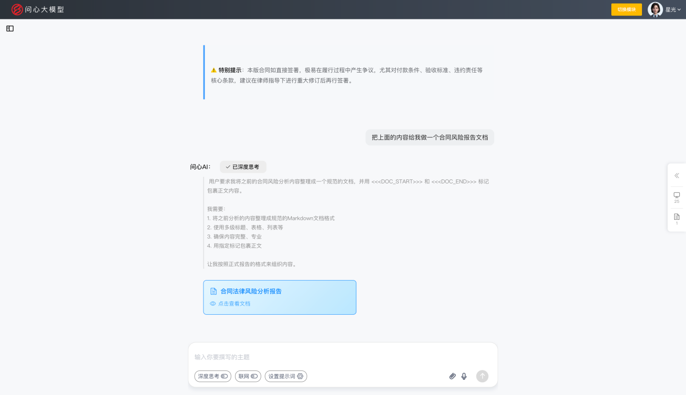
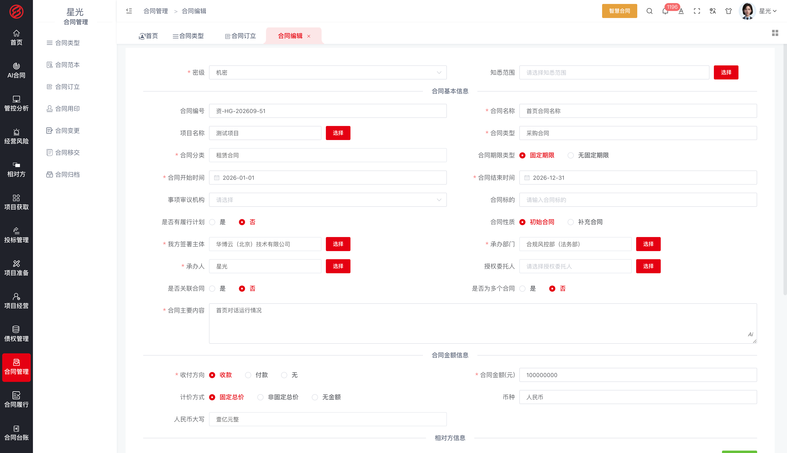
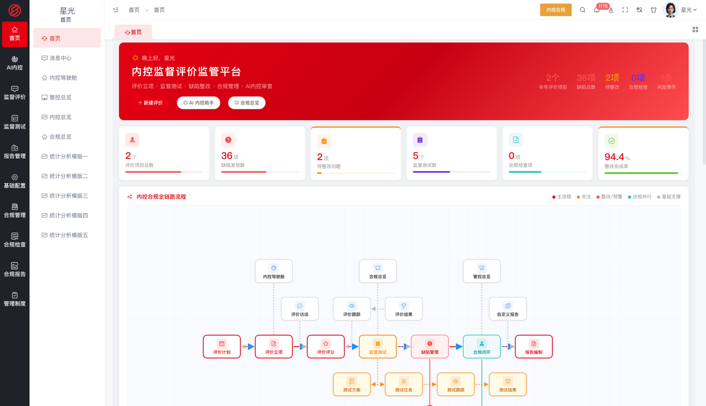
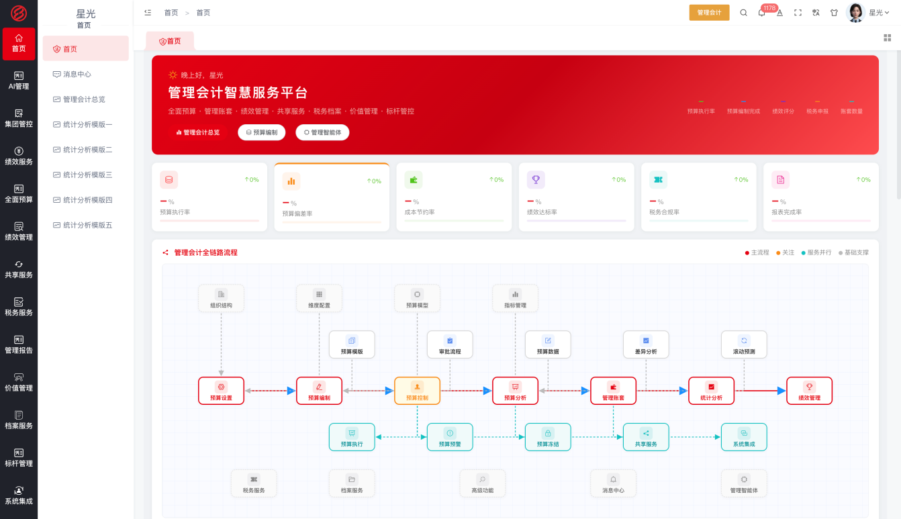
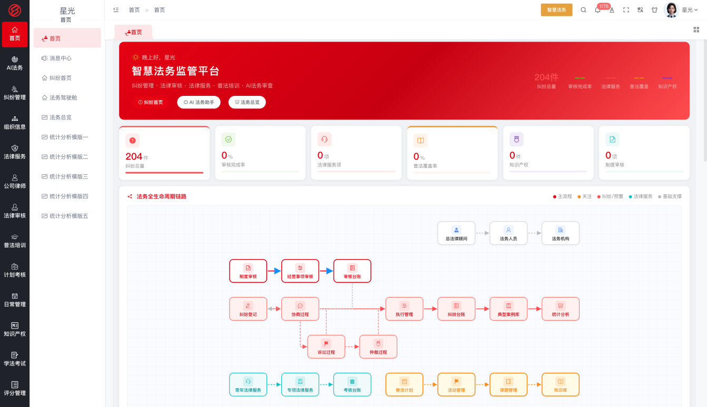
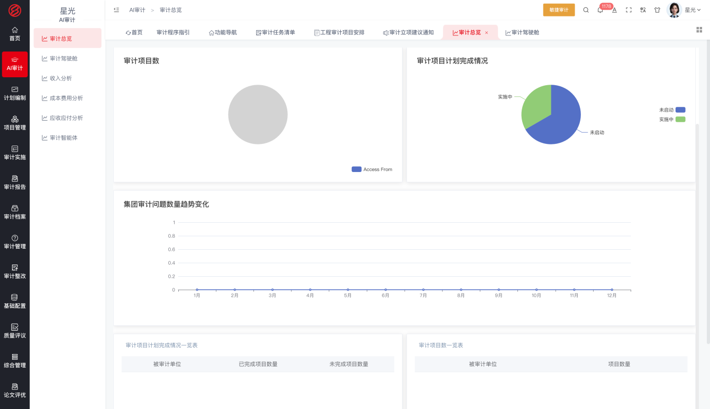
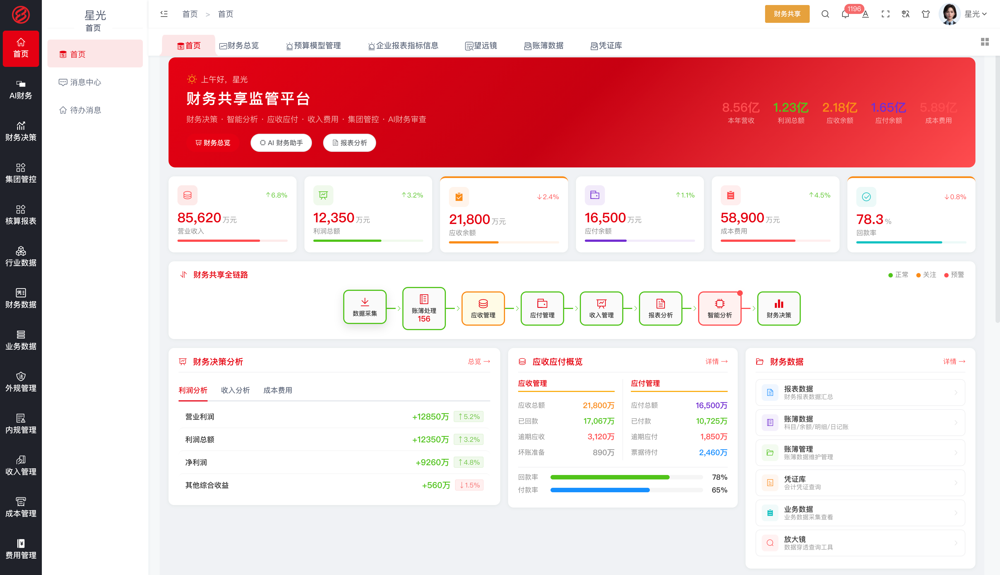

> 🌐 English | [简体中文](doc/README-zh.md)

# Wenxin Large Model · Finance-Domain Large Language Model

> Empowering AI to directly solve enterprise problems | The entire software layer is open source, free forever

   

## Platform Overview

Wenxin Large Model is a finance-domain large language model developed by Huabo Cloud (Beijing) Technology Co., Ltd. in collaboration with the technical team of Harbin Institute of Technology. Focused on the "finance brain", it deeply integrates finance-domain knowledge with reasoning and decision-making capabilities, empowering AI to directly solve enterprise problems.

The platform provides three working modes and five engines; the finance capabilities of Wenxin Large Model form the four intelligence capabilities. The model and the five engines together constitute the Enterprise AI Ontology, from which ten applications covering the entire finance chain grow. Applications are built on AI capabilities and can iterate and adjust quickly with business needs.

**Three Working Modes**

- **Menu-based** — use applications through function menus, ready out of the box
- **Skill-based** — encapsulate large-model capabilities as composable skills, orchestrated per scenario
- **Conversational** — talk to the large model to perform business operations directly; AI solves problems directly

**Four Intelligence Capabilities**

- **AI Office** — the conversational working capability of the large model, turning daily office tasks into natural language
- **AI Consulting** — management-consulting capability; finance expert knowledge is distilled into intelligent Q&A
- **AI Modeling** — dynamic modeling capability; indicators, rules and risk models are built dynamically with the business
- **AI Coding** — application generation capability; dynamic modeling, real-time coding, delivery anytime

The four intelligence capabilities run on top of the Enterprise AI Ontology and act on the enterprise's business objects and rules, forming a value loop from model capability to business execution.

| **AI Office** | **AI Consulting** | **AI Modeling** | **AI Coding** |
|---|---|---|---|
|   |   |    |   |

**Wenxin Agents**

The Wenxin Agent is the running unit that carries the four intelligence capabilities and executes business: on the Agent Platform, model capabilities, knowledge bases, tools and business processes are orchestrated together, applied to the Enterprise AI Ontology and distributed to business modules for use — covering the whole flow from building to using.

- **Build** — create applications on the Agent Platform (conversational or workflow type), visually orchestrate workflow nodes (LLM calls, knowledge retrieval, conditional branches, template conversion, code execution, tool calls, etc.), write prompts and configure model parameters; attach knowledge bases (upload enterprise policies and business documents for retrieval augmentation) and tool plugins, so agents acquire enterprise knowledge and business capabilities
- **Debug & Publish** — validate results through conversation debugging; publish applications upon confirmation and automatically obtain an API key; supports dual-track operation of draft debugging and published running
- **Authorize & Distribute** — in System Settings → Agent Management, distribute and authorize agents to business modules and members, controlling who can use what, and where
- **Use** — business users invoke agents through the AI assistant inside business modules, raising business requests via conversation; the agent understands and executes the corresponding business operations; direct business access via conversation is also supported
- **Audit Trail** — conversation history and running records are retained for review, supporting continuous agent optimization

|  |  |

**Five Engines**

Organization Engine · Role Engine · Process Engine · Form Engine · Rule Engine — the operational foundation that brings the large model into enterprise operation.

**Enterprise AI Ontology**

The Enterprise AI Ontology is the enterprise's digital twin and operating layer: it models the enterprise's organizational structure, business objects, relationships and control rules into a standardized knowledge system. Its foundation consists of three parts — enterprise-specific development templates constrain AI behavior norms, MCP tool integration connects enterprise knowledge and norms, and skill authorization defines capability boundaries and execution approvals. Wenxin Large Model runs on top of the ontology, becoming an AI that understands the enterprise's own structure, norms and business, continuously operating, learning and executing business within the enterprise.

**Platform Architecture**

Wenxin Large Model is structured in four layers from top to bottom: the large-model foundation, the five engines, the Enterprise AI Ontology, and the applications of the four intelligence capabilities. The large-model foundation provides finance-domain understanding, reasoning and decision-making; the five engines — organization, role, process, form and rule — model enterprise operating elements into a standardized knowledge system; together they constitute the Enterprise AI Ontology — the enterprise's digital twin and operating layer, accumulating business objects, relationships and control rules. The four intelligence capabilities run on top of the ontology, growing applications that cover the entire business chain of enterprise supervision and operation.

## Ten Finance Applications

The following applications are all built on the Wenxin Large Model platform. They are the concrete implementations of the four intelligence capabilities in finance business scenarios, covering the entire business chain of enterprise supervision and operation; each application can be used standalone or run as an integrated whole.

| # | Application | One-line Introduction |
|---|---|---|
| 1 | SOE Look-Through | Thirteen look-through supervision dimensions, full-level look-through from group headquarters to end-level enterprises, revealing true operating conditions |
| 2 | Risk Control | Full lifecycle management of risk identification, assessment, monitoring, early warning and disposal; an intelligent risk-control cockpit shows risk posture in real time |
| 3 | Internal Control & Compliance | Internal control matrix management, compliance rule base, compliance checks and process execution monitoring, ensuring operations meet regulatory requirements |
| 4 | Intelligent Contract | Full lifecycle contract management with AI-assisted drafting and review plus legal risk identification, reducing contract performance risk |
| 5 | Financial Sharing | Centralized processing of general ledger, receivables, payables, fixed assets and expense reimbursement, improving financial operations efficiency |
| 6 | Management Accounting | Cost centers, product costing, internal settlement, multi-dimensional cost analysis and control, supporting management decisions |
| 7 | Global Treasury | Cash management, account management, capital planning, investment and financing management, bill management, derivatives management |
| 8 | Intelligent Legal | AI-powered legal document review, compliance checks, case retrieval and legal analysis advice |
| 9 | Agile Audit | Full-process management of audit planning, project implementation, report review, archives, rectification and quality assessment, with AI-assisted tools improving efficiency |
| 10 | Rectification & Accountability | Post-issue rectification tracking, accountability tracing, closed-loop management and effectiveness evaluation |

### Application UI Preview

| Application | UI |
|---|---|
| **1. SOE Look-Through** |   |
| **2. Risk Control** |   |
| **3. Internal Control & Compliance** |   |
| **4. Intelligent Contract** |   |
| **5. Financial Sharing** |   |
| **6. Management Accounting** |   |
| **7. Global Treasury** |   |
| **8. Intelligent Legal** |   |
| **9. Agile Audit** |   |
| **10. Rectification & Accountability** |   |

## Open-Source Statement

The software layer of this project (all business modules) is open source and free forever: both individuals and enterprises may use it free of charge and are allowed to modify it; commercial use is prohibited — no enterprise, institution or individual may sell this software or package it as a paid product/service.

- **Version system**: Government Supervision Edition / Central Enterprise Edition / State-Owned Enterprise Edition / Listed Company Edition / International Enterprise Edition / University Training Edition / Industry Custom Edition / Open-Source Free Edition
- **Database adaptation**: Fully adapted to Xinchuang (domestic IT innovation) environments (DM / Oracle / MySQL), meeting the localization requirements of central and state-owned enterprises
- **License**: Free to use · Commercial use prohibited

| Rights & Obligations | Description |
|---|---|
| ✓ Personal use | Allowed — for personal study, research and use, completely free |
| ✓ Enterprise use | Allowed — internal installation and deployment for your own business operations, free forever |
| ✓ Modification | Allowed — may be modified and re-developed for your own business needs (modified versions are likewise prohibited from commercial use) |
| × Commercial use (prohibited) | Must not sell, resell or distribute for a fee this software (including modified and derivative versions), directly or indirectly |
| × Commercial use (prohibited) | Must not package this software as a paid product or paid service (including SaaS mode) for external offering |
| ! Commercial licensing | Resale, integration into paid products, or providing paid services requires a separate written commercial license agreement |
| ! Copyright notice | The original copyright statement must be retained when using and redistributing |
| × Warranty | Not provided — the software is provided "as is", with no express or implied warranty |

Applicable scenarios: personal study and research; free internal enterprise use. Business cooperation (resale, integration, paid services) requires commercial authorization.

## Contact Us

- Website: https://huabocn.com
- Email: 18600042653@163.com

Wenxin Large Model · Master AI, Ask the Heart

---

# Financial Sharing Powered by Wenxin Large Model

Financial Sharing uses the event-accounting middle platform as its core engine: business events automatically generate accounting vouchers, integrating accounting, budgeting and consolidation to improve financial operations efficiency.

## Feature Composition

### Event Accounting Middle Platform

Business events enter the event center in a unified way; the accounting rule center matches rules by recognition condition and timing to generate vouchers automatically; the accounting center provides voucher management, generation, review, posting, templates and analysis — automation and traceability from business to voucher; voucher templates support one-click generation for common businesses; voucher analysis monitors the quality and efficiency of auto-generated vouchers; rule adjustments take effect immediately.

### General Ledger Accounting

Account balances and detail ledgers support multi-period, multi-account range queries; trial balance automatically verifies debit-credit balance; general ledger queries drill from balances down to vouchers; period-end processing guides closing step by step.

### Receivables & Payables Management

Receivable registration links to collection plans with configurable aging ranges and bad-debt management by aging; payable registration links to payment plans and payment terms with payments controlled by term — related-party balances and aging risks are clear throughout.

### Expense Reimbursement

General reimbursement, travel reimbursement and other forms flow online with automatic validation against travel standards; approval rules are tiered by amount; reimbursement payment is linked to budget control, auto-blocking or alerting on budget overrun. Travel standards, approval rules and budget control rules are maintained centrally in basic configuration, and adjustments take effect globally.

### Fixed Assets & Inventory

Asset cards record original value, department and status; depreciation accrues automatically monthly; changes, disposal and stocktaking leave traces; inventory is accounted by valuation method with automatic cost carry-forward; stocktaking differences automatically generate accounting adjustments, keeping books and reality consistent.

### Revenue Management

Revenue recognition triggers automatically by business rules; contract revenue links to performance progress; deferral and adjustment leave traceable records.

### Budget Management

Budget preparation provides templates, versions, decomposition and approval — top-down decomposition and bottom-up reporting; budget control provides execution monitoring, occupation, release, transfer and alerts, linked to reimbursement and payment documents, auto-blocking or alerting over-budget requests.

### Consolidated Statements

Consolidation scope management, consolidation models, elimination templates, elimination vouchers, equity structure and reconciliation analysis — intercompany transactions are eliminated automatically, upgrading group consolidation from manual aggregation to system consolidation.

### Three Workbenches

The personal workbench handles to-dos, the finance workbench handles accounting operations, and the management workbench presents operating dashboards such as budget execution rate.

## Business Process

After a business event occurs, it enters the event center; the accounting rule center matches rules by recognition condition and timing and generates accounting vouchers automatically; vouchers enter the general ledger after review and posting, with step-guided period-end closing; receivables/payables, expense reimbursement, assets, inventory and revenue operations are processed centrally in the shared center with budget control validating and blocking in sync; at group level, consolidated statements are prepared by consolidation scope with automatic intercompany elimination; the three workbenches present results by layer — full-chain automation from business occurrence to financial reporting.

## Business Value

Financial Sharing converts business events into accounting vouchers automatically: automated accounting with multi-standard adaptation; integration of general ledger, related parties, expenses, assets, inventory and revenue; hard budget control and systematized consolidation; three workbenches serving by layer — improving financial operations efficiency and accounting quality together.

## Repository Contents

| Service | Port | Description |
|---|---|---|
| springboothbyunFinancialSharing | 8682 | Financial sharing service (event accounting middle platform, general ledger, reimbursement, budget, consolidation) |
| doc/ | — | [Backend Service Startup Guide](doc/后端服务启动说明.md): build configuration, database preparation, sanitization reference, startup steps and troubleshooting |

Depends on the registry, gateway, system module and AI large-model services provided by the base module repository (Wenxin Large Model Base Module).

## Tech Stack & Startup

- Tech stack: Spring Boot / Spring Cloud (Eureka + Gateway), JDK 1.8, Maven 3.6+, DM/MySQL database, Redis.
- Startup order: first start the registry and gateway from the base module repository, then start this module: `mvn spring-boot:run`.
- Before the first build, install the offline jars (DM driver etc., see the `repository` directory of the base module repository); see the [Backend Service Startup Guide](doc/后端服务启动说明.md) for details.
- The code is sanitized: database passwords, secrets and IPs are placeholders; replace them with real environment configuration (application-dev.yml) before startup.
